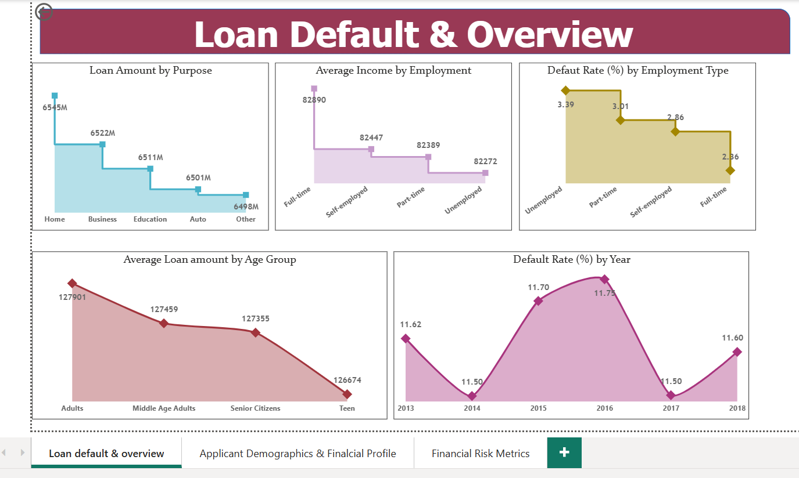
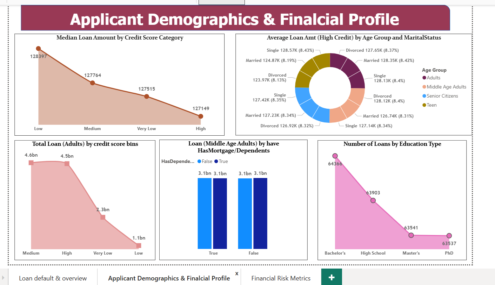
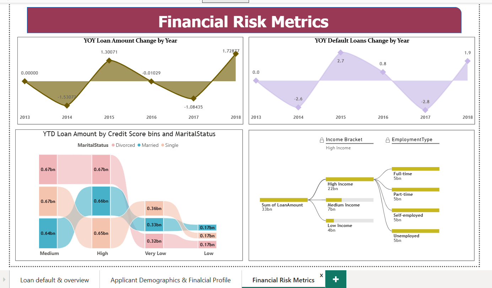

# Loan Default Risk Analysis — Power BI Report

---

## Project Overview

This Power BI project analyzes loan default risk across **255,347 loan records** to identify key patterns in borrower behavior, financial profiles, and default trends. The dataset was imported into **SQL Server** and connected to Power BI for analysis. The report consists of three interactive pages designed to help financial institutions make smarter lending decisions.

---

## Business Problem

Loan defaults are a major financial risk for lenders. This project answers critical questions:

- Which borrower segments are most likely to default?
- How does employment type affect default rates?
- What is the relationship between credit score and loan amount?
- How have default rates changed over the years?

---

## Dataset Overview

| Feature | Details |
|---|---|
| Source | Udemy Course Resource |
| Records | 255,347 rows |
| Columns | 19 features |
| Target Variable | `Default` (0 = No Default, 1 = Default) |
| Default Rate | 11.6% (29,653 defaults) |
| Time Period | 2013 – 2018 |
| Missing Values | None |

**Key Columns:**
`LoanID` · `Age` · `Income` · `LoanAmount` · `CreditScore` · `MonthsEmployed` · `InterestRate` · `LoanTerm` · `DTIRatio` · `Education` · `EmploymentType` · `MaritalStatus` · `HasMortgage` · `HasDependents` · `LoanPurpose` · `HasCoSigner` · `Default`

---

## Report Pages

### Page 1 — Loan Default & Overview

High-level summary of loan amounts, income distribution, and default trends across employment types and age groups.

---

### Page 2 — Applicant Demographics & Financial Profile

Deep dive into borrower profiles — credit score categories, age groups, marital status, education level, and mortgage/dependent status.

---

### Page 3 — Financial Risk Metrics

Year-over-year changes in loan amount and default rates, loan distribution by credit score and marital status, and income bracket vs employment type breakdown.

---

## Key Insights

**Default Risk**
- Unemployed borrowers have the highest default rate — 3.39%
- Full-time employed borrowers have the lowest default rate — 2.36%
- Default rate peaked in 2015–2016 at 11.75% and recovered to 11.60% by 2018

**Loan Amount**
- Home loans have the highest total disbursement — 6,545M
- Adults take the highest average loan amount — 127,901
- Teens take the lowest average loan amount — 126,674

**Credit Score Insights**
- Borrowers with low credit scores take higher median loan amounts (128,397) than high credit score holders (127,149)
- Adults with medium credit scores have the highest total loan volume — 4.6bn

**Education & Demographics**
- Bachelor's degree holders take the most loans — 64,366
- Loan distribution across education levels is surprisingly even (63,537 – 64,366)
- Mortgage and dependent status has minimal impact on Middle Age Adults' loan behavior

**Financial Risk**
- High Income group holds the largest total loan amount — 22bn
- All employment types have nearly equal loan distribution — 5bn each
- 2018 saw the highest YOY loan amount growth — +1.73%

---

## Tools Used

| Tool | Purpose |
|---|---|
| SQL Server | Data import & connection to Power BI |
| Power BI Desktop | Report creation & visualization |
| DAX | Custom measures and calculations |
| Power Query | Data transformation & cleaning |

---

## How to Open

1. Download **Loan.pbix**
2. Open with [Power BI Desktop](https://powerbi.microsoft.com/desktop/) (free)
3. The dataset is embedded — no additional setup needed

